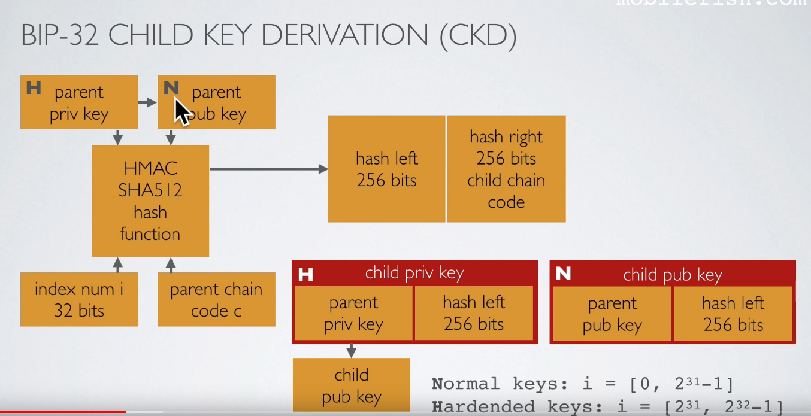

#### Week 5 : Scripts and Wallets
---

**Group questions:**
- What are the difficulties and benefits of switching to Pay to Taproot addresses?
    - difficulties: all the wallet software will need to upgrade and user adoption will have to happen
    - benefits: privacy, less block space
- What makes Pay to Taproot more private than previous output formats?
    - makes multi-sig and single-sig indistinguishable because linearity of Schnorr allows aggregate signatures
- What is the benefit of using output descriptors?
    - it indicates the wallet software what type of output script (SPK: scriptPubKey) to use (P2(W)SH/P2(W)PKH), also provides a checksum to avoid typos
- **What is the difference between child and hardened child addresses?**
    - master xprv(xpub) =  master pvt(pub) key + parent chain code
    - xprv keys can create a complete branch with child private keys and child public keys (hardened)
    - xpub keys can only create a branch of child public keys (non-hardened)
    - Non-hardened useful for watch/receive only wallet
    - H = hash(xpriv+index), N = hash(xpub+index) 
    - normal keys: i = [0, 2^31-1], hardened keys: i = [2^31, 2^32-1]
    - Bitcoin core: m/0'/0'/0 is non-hardened, m/0'/0'/0' is hardened
    - The chain code is used as entropy in the Child Key Derivation (CDK) function
    - [BIP32: CKD function](https://github.com/bitcoin/bips/blob/master/bip-0032.mediawiki#Child_key_derivation_CKD_functions)
    - 
    - [stackexchange link](https://bitcoin.stackexchange.com/questions/37488/eli5-whats-the-difference-between-a-child-key-and-a-hardened-child-key-in-bip3)
    - [andreas on watch-only xpub](https://youtu.be/tPCN3nDVzZI?t=463)
    - **Questions:**
        - how are non-hardened tx utxo spent if there is no private keys to sign transactions?
- Is coin age ever a consideration for coin selection?
    - [coin selection, bitcoin.design](https://bitcoin.design/guide/how-it-works/coin-selection/)
    - FIFO/LIFO/Highest Priority First?

--- 
**Other questions/doubts:**
- Why not use chain code as 2nd factor/passphrase?
- Fee estimation: is target block using historical data ? if so, isn't that vulnerable to miners gaming it as mentioned in the first part of the article?
- Why not an option to invalidate a tx after n blocks?
- How does batching of tx work?

---

**NOTES:**

**Contracts (John Newbery [talk](https://www.youtube.com/watch?v=H-wH6mY9pZo&t=2549s)):**
- Objectives of contract design: obervability, verifiability, privacy and enforceability
- The nodes only need to understand the transaction to the extent of evaluating whether the sender's conditions are met
- The script is a predicate(true/false)
- Contracts executed by explicity published code are really only using the blockchain for only one thing: to get an immutable ordering of what order the txs happen in(irreversible and prevent double-spend)
- Turing-complete langauges define computably enumerable predicates(less secure!)
- Script evolution:
    - 2009: scriptSig/SS(input) -> scriptPubKey(SPK)(output)
    - 2012: pay to script hash (P2SH) makes outputs fixed size => fixed address length
    - 2016: Segregated Witness(removes witness from txid data) (P2WSH, P2WPKH)
    - Future: Schnorr signatures and MuSig; (multi-sig and single sig tx look alike); MAST- script trees - commitment can be tree of conditions; Taproot and Graftroot; Adaptor signatures(adv contracts and atomic swaps)

** [Script](https://learnmeabitcoin.com/technical/script) - programming language:**
- Each output has a value(in sats, 8 bytes), SPK size(variable size, VarInt) and a lock(ScriptPubKey/SPK), it is unlocked by owner of it's key and used as an input in a tx.
- Script contains : Data(public keys/signatures) and OPCODES(simple functions that operatae on that data)
- P2PKH example: signature|pub-key|DUP|HASH160|hash160(pub-key)|EQUALVERIFY|CHECKSIG
- The script is run left-to-right and pushed on to a stack
- OPCODES can pop elements off the stack, do something with them, then optionally push new elements ont the stack, ex. DUP duplicates the top element of the stack
- A script is valid only if the top and only element left on the stack is a 1(or greater)

**[Scripts - John Newbery](https://www.youtube.com/watch?v=np-SCwkqVy4):**
- P2PK ; pay to pub key, the simplest scriptPubKey. The condition for spending P2PK output is signing a message with the pvt key correspondning to the given pub key. The scriptPubKey contains the pub key (33 bytes for compressed) and the OP_CHECKSIG opcode(1 byte) and the scriptSig contains just a signature(71 bytes)
- Multi-sig
- P2PKH: pay to pubkey hash locks an output with the hash digest of a pubkey, conditions for spending a P2PKHs is providing:
    - a pub key that hashes to the hash digest
    - a signature of a msg with pvt key corresponding to the given pub key
- P2SH: pay to script hash locks an output with hash digest of any arbitrary script, the condition for spending:
    - a SCRIPT that hashes to the hash digest
    - the data required to satisfy the locking conditions in that script
- Why P2SH: 
    - scriptPubKeys for P2SH are (small) uniform size
    - the sender doesn't need to know the spending conditions for what they're sending
    - the receiver pays the fee for large or complex scripts
    - A scriptPubKye can be encoded as a Bitcoin address
- Segwit(BIP 141): P2WPKH & P2WSH (w:witness)
- Verification is much easier and more scalable than computation on the blockchain
- Scaling contracts: 
    - only reveal spending conditions at time of spend (P2SH or P2WSH)
    - multiple payments into one on-chain commitment: layer2  (eg lightning)
    - only reveal the branch of the contract that was executed: MAST, Taproot
    - in the best case where everyone agrees, only broadcast a single(threshold) signature: Taproot, Graftroot
    - combine multiple signatures into a single signature: threshold signatures
    - embed additional conditions/commitments invisibly into digital signatures: adaptor signatures and scriptless scripts

**Additional notes:**
- Scriptless scripts: magicking digital signatures so that they can only be created by faithful execution of a smart contract, limited in power. Mimblewimble is a blockchain design that supports only scriptless scripts, and derives its privacy and scaling properties from this.
- Threshold signatures: some numerical value must be met for an operation to succeed. A common threshold cryptographic scheme is Shamir's secret sharing scheme. It involves using a Lagrange interpolation to recombine split values into a secret value.
- Adaptor signatures: work across blockchains, even if they use different EC groups. After a signature hits the chain, anyone can make up a (t, T) and compute a corresponding "adaptor signature" for it, so the scheme is deniable. It also doesn't link the signatures in any way. Adaptor signatures are re-blindable, as we saw in the Lightning example.
- Miniscript: by virtue of directly representing spending conditions, allows arbitary policies to be expressed such that anyone can:
    - compute the associated address(es) to the script;
    - determine which signers are necessary or sufficient to signing at a given time;
    - produce a valid tx, given a sufficient set of signatures
- Miniscript allows wallet(application) independent policies
- Output descriptors: is a universal way to describe the multitude of different address types that Core supported
- Simplicity: is a low-level language designed to be directly embedded in blockchain transactions
- PSBT: partially signed bitcoin tx (BIP 174), is a wallet interoperability protocol
- Fee estimation: uses buckets of fee in 10% increments and uses exponentially weighted averages (decreasing weight from newer to older)
- Fee bumping: via RBF (replace by fees by sender) or CPFP(child pays for parent  by receiver). RBF creates a new txid. RBF invalidates original tx and requires all signers to sign. Additional inputs can be added in the replacement tx.
CPFP to bump the fee can increate the total fee signficantly since it pays for the child tx additionally.
- P2SH using ECDSA requires knowledge of each public key in a multi-sig so more tx footprint, tx costs and less privacy. With Schnorr you get non-malleability and it's  linearity allows aggregate keys into single key also making multi-sig tx indistinguishable from single-sig tx. MuSig enables multisig participants to attach encumberances to the aggregated keys off-chain and also enable smart contract solutions like Taproot.
- Schnorr also allows cross-input aggregation by combining multiple inputs into one, this could provide strong privacy mechanisms on Bitcoin. (Generalized Taproot or G'root)
- Cross-input aggregation can enable the construction of **Schnorr-based CoinJoin transactions** with n signers that look like regular, single-signer transactions to outsiders. The common-denomination issue can further be resolved with additional techniques, such as Pay-to-EndPoint(P2EP). P2EP is backwards compatible and when used in conjunction with Schnorr, it may enable sufficient privacy in Bitcoin's base layer.
- BIP44 (m/44'...) uses the following derivation path:
    `m/purpose'/coin_type'/acount'/change/address_index`
        - m denotes the master node(level 0), following are the levels 1,2,3...

---
**References:**
- [HD wallets - BIP32 and BIP44](https://www.youtube.com/watch?v=2HrMlVr1QX8)
- [bip39 passphrases via password stretching](https://www.youtube.com/watch?v=jP7pEgBpaO0)
- [Blockstream proof of reserves tool](https://blog.blockstream.com/en-standardizing-bitcoin-proof-of-reserves/)
- [BIP39 mnemonic code converter](https://iancoleman.io/bip39/)
- [Blockstream liquid sidechain](https://blockstream.com/liquid/)
